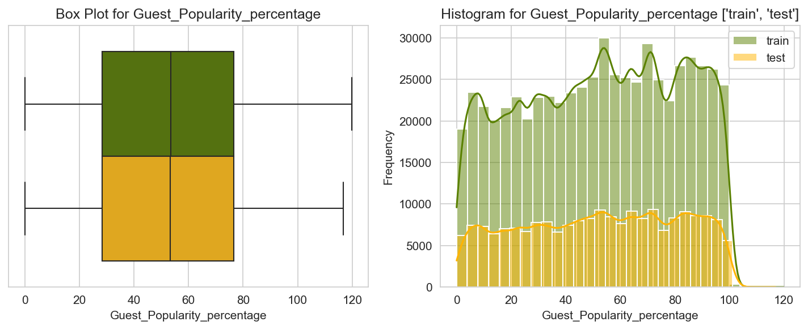
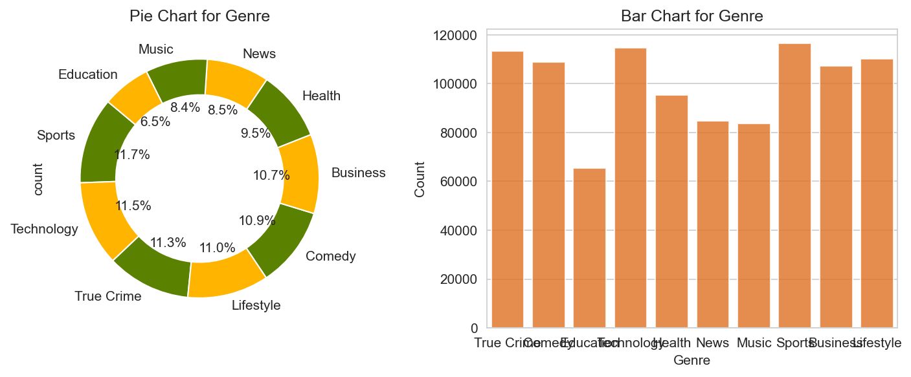
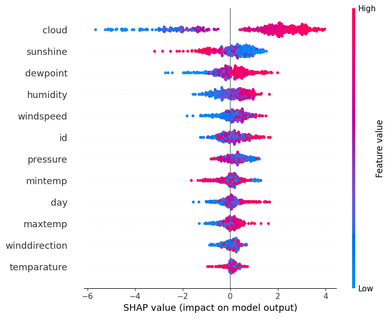

[](https://pypi.org/project/lunax/)
### 
[中文](README.CN.md) | [EN](README.md)
### 

<div>

<a href="./imgs/luna3.jpg"></a>``lunax`` 是一个用于表格数据处理分析的机器学习框架。 lunax这个名字来自于图中的这只可爱的小猫🐱，是华南理工大学最受欢迎的小猫**luna**。在[API文档](https://lunax-doc.readthedocs.io/en/latest/)中查看更详细的说明**⭐️ 如果喜欢，欢迎点个star！ ⭐️**
</div>

---

### 如何下载
```bash
conda create -n 你的环境名 python=3.11
conda activate 你的环境名
pip install lunax
```

### 已有功能
- 数据加载和预处理
- EDA分析
- 自动化机器学习建模
- 模型评估和解释
- 集成学习
- 特征重要性分析
- 面向对象设计，统一接口便于扩展
- 使用pytest进行单元测试，保证代码质量


### 快速开始
#### 数据加载和预处理
```Python
from lunax.data_processing import *
df_train = load_data('train.csv') # 或者 df = load_data('train.parquet')
target = '标签列名'
df_train = preprocess_data(df_train,target) # 数据预处理, 包括缺失值处理, 特征编码, 特征缩放
X_train, X_val, y_train, y_val = split_data(df_train, target)
```
#### EDA分析
```Python
from lunax.viz import numeric_eda, categoric_eda
numeric_eda([df_train,df_test],['train','test'],target=target) # 数值型特征分析
categoric_eda([df_train,df_test],['train','test'],target=target) # 类别型特征分析
```
<table>
  <tr>
    <td></td>
    <td></td>
  </tr>
</table>

#### 自动化机器学习建模
```Python
from lunax.models import xgb_clf # 或者 xgb_reg, lgbm_reg, lgbm_clf, cat_reg, cat_clf
from lunax.hyper_opt import OptunaTuner
tuner = OptunaTuner(n_trials=10,model_class="XGBClassifier") # 超参数优化, n_trials为优化次数
# 或者 "XGBRegressor", "LGBMRegressor", "LGBMClassifier", "CatRegressor", "CatClassifier"
results = tuner.optimize(X_train, y_train, X_val, y_val)
best_params = results['best_params']
model = xgb_clf(best_params)
model.fit(X_train, y_train)
```
#### 模型评估和解释
```Python
model.evaluate(X_val, y_val)
```
```text
[lunax]> label information:
+---------+---------+
|   label |   count |
+=========+=========+
|       1 |     319 |
+---------+---------+
|       0 |     119 |
+---------+---------+
[lunax]> model evaluation results:
+-----------+------------+-------------+----------+------+
| metrics   |   accuracy |   precision |   recall |   f1 |
+===========+============+=============+==========+======+
| values    |       0.73 |        0.53 |     0.73 | 0.61 |
+-----------+------------+-------------+----------+------+
```

#### 集成学习
```Python
from lunax.ensembles import HillClimbingEnsemble
model1 = xgb_clf()
model2 = lgbm_clf()
model3 = cat_clf()
for model in [model1, model2, model3]:
    model.fit(X_train, y_train)
ensemble = HillClimbingEnsemble(
    models=[model1, model2, model3],
    metric=['auc'],
    maximize=True
)
best_weights = ensemble.fit(X_val, y_val)
predictions = ensemble.predict(df_test)
```
#### 特征重要性分析
```Python
from lunax.xai import TreeExplainer
explainer = TreeExplainer(model)
explainer.plot_summary(X_val)
importance = explainer.get_feature_importance(X_val)
```

```text
[lunax]> Clear blue/red separation indicates a highly influential feature.
```


```text
[lunax]> Feature Importance Ranking:
+----+---------------+---------------------+
|    |    Feature    |     Importance      |
+----+---------------+---------------------+
| 1  |     cloud     | 2.3085615634918213  |
| 2  |   sunshine    | 0.6377484202384949  |
| 3  |   dewpoint    | 0.5257667899131775  |
| 4  |   humidity    | 0.4827548861503601  |
| 5  |   windspeed   | 0.40086665749549866 |
| 6  |      id       | 0.38620123267173767 |
| 7  |   pressure    | 0.3780971169471741  |
| 8  |    mintemp    | 0.32988569140434265 |
| 9  |      day      | 0.30587586760520935 |
| 10 |    maxtemp    | 0.26082852482795715 |
| 11 | winddirection | 0.23236176371574402 |
| 12 |  temparature  | 0.17218443751335144 |
+----+---------------+---------------------+
```